# 07-数据-ER图

> 概念级关系图，表达业务对象之间的关联。

下面这份 ER 图按“核心交易链路 + 扩展模块”组织，优先覆盖第一阶段最重要的业务关系。

```mermaid
erDiagram
    USER ||--o{ USER_ROLE : has
    ROLE ||--o{ USER_ROLE : assigned_to
    USER ||--o{ USER_ADDRESS : owns
    USER ||--o{ PRODUCT_FAVORITE : favorites

    USER ||--o| MERCHANT : may_be
    MERCHANT ||--o{ MERCHANT_QUALIFICATION : submits
    MERCHANT ||--|| MERCHANT_WALLET : owns
    MERCHANT ||--o{ WITHDRAW_APPLY : applies

    CATEGORY ||--o{ PRODUCT : contains
    MERCHANT ||--o{ PRODUCT : publishes
    PRODUCT ||--o{ PRODUCT_SKU : has
    PRODUCT ||--o{ PRODUCT_IMAGE : has
    PRODUCT ||--o{ PRODUCT_VIDEO : has
    PRODUCT ||--o{ PRODUCT_TRACE : has

    USER ||--o{ CART : adds
    PRODUCT_SKU ||--o{ CART : referenced_by
    MERCHANT ||--o{ CART : owns_items
    USER ||--o{ ORDERS : places
    MERCHANT ||--o{ ORDERS : receives
    ORDERS ||--|{ ORDER_ITEM : includes
    PRODUCT ||--o{ ORDER_ITEM : snapshot_of
    PRODUCT_SKU ||--o{ ORDER_ITEM : snapshot_of

    ORDERS ||--o{ PAYMENT_RECORD : pays_by
    ORDERS ||--o{ DELIVERY_RECORD : ships_by
    ORDERS ||--o{ REFUND_APPLY : aftersales
    ORDER_ITEM ||--o{ REFUND_APPLY : targets

    COUPON ||--o{ USER_COUPON : issued_as
    USER ||--o{ USER_COUPON : receives
    USER_COUPON }o--|| ORDERS : used_in

    ACTIVITY ||--o{ ACTIVITY_PRODUCT : binds
    PRODUCT ||--o{ ACTIVITY_PRODUCT : participates
    PRODUCT_SKU ||--o{ ACTIVITY_PRODUCT : optional_sku

    USER ||--o{ POINTS_LOG : points_changes

    USER ||--o| COMMUNITY_LEADER : may_be
    COMMUNITY_LEADER ||--o{ LEADER_USER_RELATION : binds
    USER ||--o{ LEADER_USER_RELATION : follows
    PICKUP_POINT ||--o{ COMMUNITY_LEADER : default_for
    PICKUP_POINT ||--o{ ORDERS : pickup_for

    COMMISSION_RULE ||--o{ COMMISSION_RECORD : governs
    COMMUNITY_LEADER ||--o{ COMMISSION_RECORD : earns
    ORDERS ||--o{ COMMISSION_RECORD : generates
    COMMUNITY_LEADER ||--o{ LEADER_WITHDRAW_APPLY : applies

    ADMIN_USER ||--o{ ADMIN_USER_ROLE : has
    ADMIN_ROLE ||--o{ ADMIN_USER_ROLE : assigned_to

    USER {
        bigint id PK
        varchar openid
        varchar unionid
        varchar nickname
        varchar avatar_url
        varchar mobile
        smallint status
    }

    ROLE {
        bigint id PK
        varchar code
        varchar name
        smallint status
    }

    USER_ROLE {
        bigint id PK
        bigint user_id FK
        bigint role_id FK
    }

    USER_ADDRESS {
        bigint id PK
        bigint user_id FK
        varchar receiver_name
        varchar receiver_mobile
        boolean is_default
    }

    PRODUCT_FAVORITE {
        bigint id PK
        bigint user_id FK
        bigint product_id FK
    }

    MERCHANT {
        bigint id PK
        bigint user_id FK
        varchar store_name
        smallint status
    }

    MERCHANT_QUALIFICATION {
        bigint id PK
        bigint merchant_id FK
        varchar qualification_type
        smallint status
    }

    MERCHANT_WALLET {
        bigint id PK
        bigint merchant_id FK
        numeric available_balance
        numeric frozen_balance
    }

    WITHDRAW_APPLY {
        bigint id PK
        bigint merchant_id FK
        varchar apply_no
        numeric amount
        smallint status
    }

    CATEGORY {
        bigint id PK
        bigint parent_id FK
        varchar name
        smallint status
    }

    PRODUCT {
        bigint id PK
        bigint merchant_id FK
        bigint category_id FK
        varchar title
        smallint status
        smallint audit_status
    }

    PRODUCT_SKU {
        bigint id PK
        bigint product_id FK
        varchar sku_code
        numeric price
        int stock
    }

    PRODUCT_IMAGE {
        bigint id PK
        bigint product_id FK
        varchar image_url
    }

    PRODUCT_VIDEO {
        bigint id PK
        bigint product_id FK
        varchar video_url
    }

    PRODUCT_TRACE {
        bigint id PK
        bigint product_id FK
        varchar trace_code
    }

    CART {
        bigint id PK
        bigint user_id FK
        bigint merchant_id FK
        bigint product_id FK
        bigint sku_id FK
        int quantity
        boolean checked
    }

    ORDERS {
        bigint id PK
        varchar order_no
        bigint user_id FK
        bigint merchant_id FK
        numeric pay_amount
        smallint order_status
        smallint pay_status
        smallint delivery_status
        smallint refund_status
    }

    ORDER_ITEM {
        bigint id PK
        bigint order_id FK
        bigint product_id FK
        bigint sku_id FK
        numeric unit_price
        int quantity
    }

    PAYMENT_RECORD {
        bigint id PK
        bigint order_id FK
        varchar pay_no
        varchar third_trade_no
        numeric amount
        smallint pay_status
    }

    DELIVERY_RECORD {
        bigint id PK
        bigint order_id FK
        varchar logistics_company
        varchar tracking_no
        smallint delivery_status
    }

    REFUND_APPLY {
        bigint id PK
        bigint order_id FK
        bigint order_item_id FK
        bigint user_id FK
        bigint merchant_id FK
        varchar refund_no
        numeric refund_amount
        smallint status
    }

    COUPON {
        bigint id PK
        varchar coupon_name
        smallint coupon_type
        numeric threshold_amount
        numeric discount_amount
        numeric discount_rate
        smallint status
    }

    USER_COUPON {
        bigint id PK
        bigint user_id FK
        bigint coupon_id FK
        bigint order_id FK
        smallint status
    }

    ACTIVITY {
        bigint id PK
        varchar activity_name
        smallint activity_type
        smallint status
    }

    ACTIVITY_PRODUCT {
        bigint id PK
        bigint activity_id FK
        bigint product_id FK
        bigint sku_id FK
        numeric activity_price
    }

    POINTS_LOG {
        bigint id PK
        bigint user_id FK
        smallint change_type
        int points
        varchar source_no
    }

    COMMUNITY_LEADER {
        bigint id PK
        bigint user_id FK
        bigint pickup_point_id FK
        varchar leader_name
        smallint status
    }

    LEADER_USER_RELATION {
        bigint id PK
        bigint leader_id FK
        bigint user_id FK
        timestamp bind_at
    }

    PICKUP_POINT {
        bigint id PK
        varchar name
        smallint status
    }

    COMMISSION_RULE {
        bigint id PK
        varchar rule_name
        smallint rule_type
        numeric commission_rate
        smallint status
    }

    COMMISSION_RECORD {
        bigint id PK
        bigint leader_id FK
        bigint order_id FK
        numeric commission_amount
        smallint status
    }

    LEADER_WITHDRAW_APPLY {
        bigint id PK
        bigint leader_id FK
        varchar apply_no
        numeric amount
        smallint status
    }

    ADMIN_USER {
        bigint id PK
        varchar username
        varchar password_hash
        varchar nickname
        smallint status
    }

    ADMIN_ROLE {
        bigint id PK
        varchar code
        varchar name
        smallint status
    }

    ADMIN_USER_ROLE {
        bigint id PK
        bigint admin_user_id FK
        bigint admin_role_id FK
    }
```

## 说明

1. 这是“概念 ER 图”，用于表达业务关系，不是最终 DDL。
2. `ORDERS` 采用复数命名，避免和 SQL 保留字 `order` 冲突。
3. 订单、支付、售后、活动、分销都保留快照字段，避免历史数据被后续商品或地址变更污染。
4. 如果你要，我可以继续把这份 ER 图拆成两张更清晰的图：
   - 核心交易图
   - 扩展模块图
