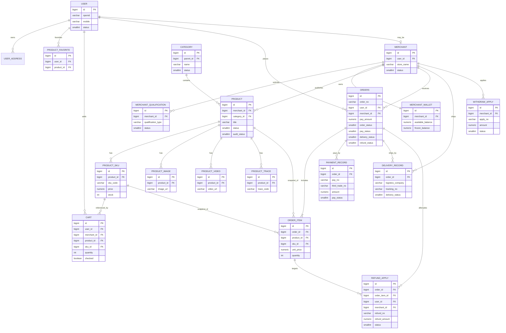

# 08-数据-核心交易图

> 聚焦第一阶段必须跑通的核心交易链路。

```mermaid
erDiagram
    USER ||--o{ USER_ADDRESS : owns
    USER ||--o{ PRODUCT_FAVORITE : favorites
    USER ||--o{ CART : adds
    USER ||--o{ ORDERS : places

    USER ||--o| MERCHANT : may_be
    MERCHANT ||--o{ MERCHANT_QUALIFICATION : submits
    MERCHANT ||--|| MERCHANT_WALLET : owns
    MERCHANT ||--o{ PRODUCT : publishes
    MERCHANT ||--o{ ORDERS : receives
    MERCHANT ||--o{ DELIVERY_RECORD : ships
    MERCHANT ||--o{ WITHDRAW_APPLY : applies

    CATEGORY ||--o{ PRODUCT : contains
    PRODUCT ||--o{ PRODUCT_SKU : has
    PRODUCT ||--o{ PRODUCT_IMAGE : has
    PRODUCT ||--o{ PRODUCT_VIDEO : has
    PRODUCT ||--o{ PRODUCT_TRACE : has

    PRODUCT_SKU ||--o{ CART : referenced_by
    PRODUCT_SKU ||--o{ ORDER_ITEM : snapshot_of
    PRODUCT ||--o{ ORDER_ITEM : snapshot_of

    ORDERS ||--|{ ORDER_ITEM : includes
    ORDERS ||--o{ PAYMENT_RECORD : pays_by
    ORDERS ||--o{ DELIVERY_RECORD : ships_by
    ORDERS ||--o{ REFUND_APPLY : aftersales
    ORDER_ITEM ||--o{ REFUND_APPLY : targets

    USER {
        bigint id PK
        varchar openid
        varchar mobile
        smallint status
    }

    MERCHANT {
        bigint id PK
        bigint user_id FK
        varchar store_name
        smallint status
    }

    CATEGORY {
        bigint id PK
        bigint parent_id FK
        varchar name
        smallint status
    }

    PRODUCT {
        bigint id PK
        bigint merchant_id FK
        bigint category_id FK
        varchar title
        smallint status
        smallint audit_status
    }

    PRODUCT_SKU {
        bigint id PK
        bigint product_id FK
        varchar sku_code
        numeric price
        int stock
    }

    CART {
        bigint id PK
        bigint user_id FK
        bigint merchant_id FK
        bigint product_id FK
        bigint sku_id FK
        int quantity
        boolean checked
    }

    ORDERS {
        bigint id PK
        varchar order_no
        bigint user_id FK
        bigint merchant_id FK
        numeric pay_amount
        smallint order_status
        smallint pay_status
        smallint delivery_status
        smallint refund_status
    }

    ORDER_ITEM {
        bigint id PK
        bigint order_id FK
        bigint product_id FK
        bigint sku_id FK
        numeric unit_price
        int quantity
    }

    PAYMENT_RECORD {
        bigint id PK
        bigint order_id FK
        varchar pay_no
        varchar third_trade_no
        numeric amount
        smallint pay_status
    }

    DELIVERY_RECORD {
        bigint id PK
        bigint order_id FK
        varchar logistics_company
        varchar tracking_no
        smallint delivery_status
    }

    REFUND_APPLY {
        bigint id PK
        bigint order_id FK
        bigint order_item_id FK
        bigint user_id FK
        bigint merchant_id FK
        varchar refund_no
        numeric refund_amount
        smallint status
    }

    MERCHANT_QUALIFICATION {
        bigint id PK
        bigint merchant_id FK
        varchar qualification_type
        smallint status
    }

    MERCHANT_WALLET {
        bigint id PK
        bigint merchant_id FK
        numeric available_balance
        numeric frozen_balance
    }

    WITHDRAW_APPLY {
        bigint id PK
        bigint merchant_id FK
        varchar apply_no
        numeric amount
        smallint status
    }

    PRODUCT_FAVORITE {
        bigint id PK
        bigint user_id FK
        bigint product_id FK
    }

    PRODUCT_IMAGE {
        bigint id PK
        bigint product_id FK
        varchar image_url
    }

    PRODUCT_VIDEO {
        bigint id PK
        bigint product_id FK
        varchar video_url
    }

    PRODUCT_TRACE {
        bigint id PK
        bigint product_id FK
        varchar trace_code
    }
```

## 说明

1. 这张图只覆盖核心交易闭环。
2. `ORDERS` 使用复数命名，和实际表名 `orders` 保持一致。
3. 订单、支付、售后、发货都保留快照字段，避免历史数据污染。
