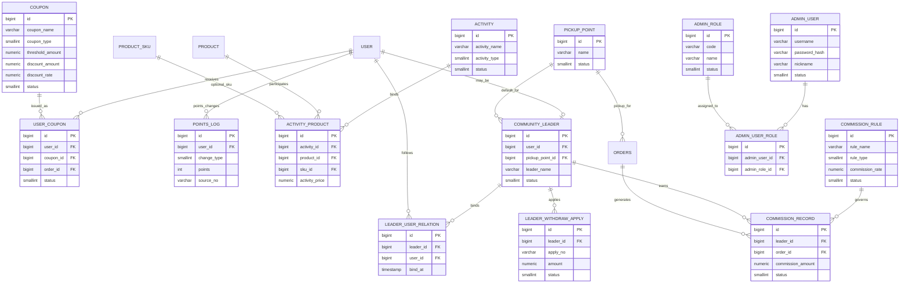

# 09-数据-扩展模块图

> 覆盖营销、积分、分销、自提点和后台权限等扩展能力。

```mermaid
erDiagram
    USER ||--o{ USER_COUPON : receives
    COUPON ||--o{ USER_COUPON : issued_as
    USER ||--o{ POINTS_LOG : points_changes

    ACTIVITY ||--o{ ACTIVITY_PRODUCT : binds
    PRODUCT ||--o{ ACTIVITY_PRODUCT : participates
    PRODUCT_SKU ||--o{ ACTIVITY_PRODUCT : optional_sku

    USER ||--o| COMMUNITY_LEADER : may_be
    COMMUNITY_LEADER ||--o{ LEADER_USER_RELATION : binds
    USER ||--o{ LEADER_USER_RELATION : follows
    PICKUP_POINT ||--o{ COMMUNITY_LEADER : default_for
    PICKUP_POINT ||--o{ ORDERS : pickup_for

    COMMISSION_RULE ||--o{ COMMISSION_RECORD : governs
    COMMUNITY_LEADER ||--o{ COMMISSION_RECORD : earns
    ORDERS ||--o{ COMMISSION_RECORD : generates
    COMMUNITY_LEADER ||--o{ LEADER_WITHDRAW_APPLY : applies

    ADMIN_USER ||--o{ ADMIN_USER_ROLE : has
    ADMIN_ROLE ||--o{ ADMIN_USER_ROLE : assigned_to

    COUPON {
        bigint id PK
        varchar coupon_name
        smallint coupon_type
        numeric threshold_amount
        numeric discount_amount
        numeric discount_rate
        smallint status
    }

    USER_COUPON {
        bigint id PK
        bigint user_id FK
        bigint coupon_id FK
        bigint order_id FK
        smallint status
    }

    POINTS_LOG {
        bigint id PK
        bigint user_id FK
        smallint change_type
        int points
        varchar source_no
    }

    ACTIVITY {
        bigint id PK
        varchar activity_name
        smallint activity_type
        smallint status
    }

    ACTIVITY_PRODUCT {
        bigint id PK
        bigint activity_id FK
        bigint product_id FK
        bigint sku_id FK
        numeric activity_price
    }

    COMMUNITY_LEADER {
        bigint id PK
        bigint user_id FK
        bigint pickup_point_id FK
        varchar leader_name
        smallint status
    }

    LEADER_USER_RELATION {
        bigint id PK
        bigint leader_id FK
        bigint user_id FK
        timestamp bind_at
    }

    PICKUP_POINT {
        bigint id PK
        varchar name
        smallint status
    }

    COMMISSION_RULE {
        bigint id PK
        varchar rule_name
        smallint rule_type
        numeric commission_rate
        smallint status
    }

    COMMISSION_RECORD {
        bigint id PK
        bigint leader_id FK
        bigint order_id FK
        numeric commission_amount
        smallint status
    }

    LEADER_WITHDRAW_APPLY {
        bigint id PK
        bigint leader_id FK
        varchar apply_no
        numeric amount
        smallint status
    }

    ADMIN_USER {
        bigint id PK
        varchar username
        varchar password_hash
        varchar nickname
        smallint status
    }

    ADMIN_ROLE {
        bigint id PK
        varchar code
        varchar name
        smallint status
    }

    ADMIN_USER_ROLE {
        bigint id PK
        bigint admin_user_id FK
        bigint admin_role_id FK
    }
```

## 说明

1. 这张图覆盖扩展运营与后台权限能力。
2. 营销、积分、分销可以后置，不影响核心交易闭环。
3. 后台账号体系如果独立，可以直接以这张图为准扩展权限域。
